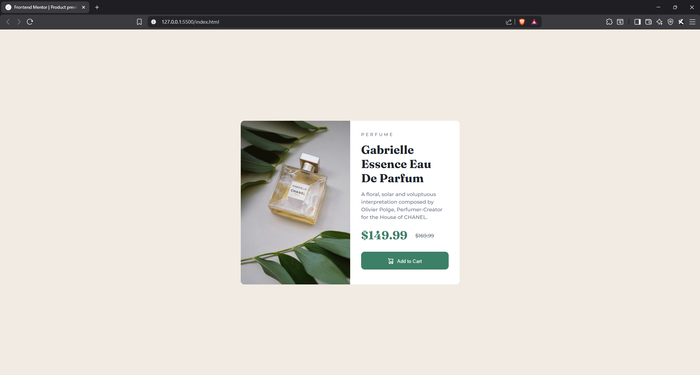
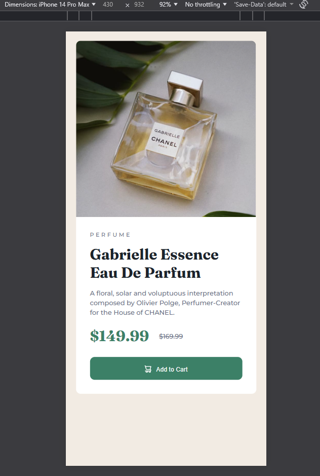

# Frontend Mentor - Product preview card component solution

This is a solution to the [Product preview card component challenge on Frontend Mentor](https://www.frontendmentor.io/challenges/product-preview-card-component-GO7UmttRfa).

## Table of contents

- [Overview](#overview)
  - [The challenge](#the-challenge)
  - [Screenshot](#screenshot)
  - [Links](#links)
  - [Built with](#built-with)
  - [What I learned](#what-i-learned)
- [Acknowledgments](#acknowledgments)

## Overview

### The challenge

Users should be able to:

- View the optimal layout depending on their device's screen size
- See hover and focus states for interactive elements

### Screenshot
-Desktop View  

-Mobile View  

-Active State  

### Links

- Live Site URL: [Visit](https://amirultechie.github.io/Frontend-Mentor---Product-preview-card-component-solution/)

### Built with

- Semantic HTML5 markup
- CSS custom properties

### What I learned

I am now aware of how a product card is designed and how I should approach building a profile card.

## Acknowledgments

As always, heartfelt respect for my true mentor of my web development, Ali Hossain. Github: [ShovoAlways](https://github.com/shovoalways/shovoalways)
